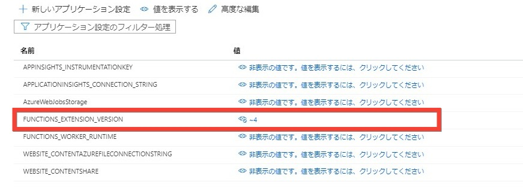

Azure Functions v4 の GA が発表されました。

[Azure Functions 4.0 and .NET 6 support are now generally available](https://techcommunity.microsoft.com/t5/apps-on-azure/azure-functions-4-0-and-net-6-support-are-now-generally/ba-p/2933245)

これからまだ言語のサポートは変わる見込みのようです。

[Drop old language versions support in Functions v4](https://github.com/Azure/Azure-Functions/issues/1999)

v3 からのマイグレーションガイド。

[Migrating from 3.x to 4.x](https://docs.microsoft.com/en-us/azure/azure-functions/functions-versions?tabs=in-process%2Cv4&pivots=programming-language-javascript#migrating-from-3x-to-4x)

Azure Portal から新規に Linux で Azure Functions を作成すると v4 で作成されていました。

