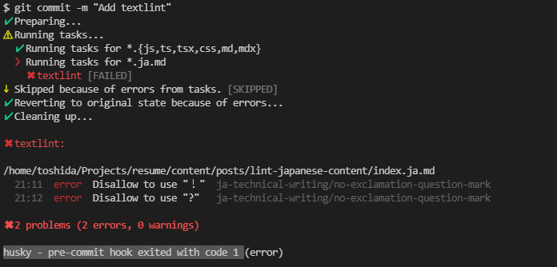

日本語コンテンツに対して [textlint](https://textlint.github.io/) を実行するように設定した。

- VSCode の設定

```json
"textlint.configPath": ".textlintrc",
"textlint.targetPath": "content/**/*.ja.md",
"textlint.nodePath": "node_modules/.bin/textlint",
```

- lint-staged の設定

```json
"lint-staged": {
  "*.{js,ts,tsx,css,md,mdx}": "prettier --write",
  "*.ja.md": "textlint"
}
```

{/* <!-- textlint-disable --> */}

[textlint-rule-preset-ja-technical-writing](https://github.com/textlint-ja/textlint-rule-preset-ja-technical-writing) を使用しているので、
この行は注意されます！?

{/* <!-- textlint-enabled--> */}

のようにエラーレベルの指摘（この場合感嘆符が文章に含まれている）があると、以下のようにコミットができない。 [^1]



また、GH Action も追加しているので、`husky` が有効になっていない環境からコミットされてきた場合は CI 上で textlint が実行される想定。[^2]

例: https://github.com/georgeOsdDev/blog/pull/1

[^1]: このファイルではスクリーンショットを取ったあとにコミットを成功させるために `<!-- textlint-disable -->` で一時的に無効化している。
[^2]: 基本的には自分の環境からでは `lint-staged` の段階で弾かれるので、PR まで漕ぎ着けなくなる。
